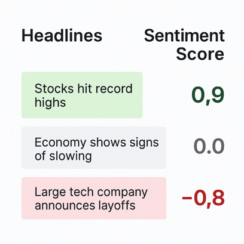

# Sentiment Analysis


A production-grade NLP project that implements Knowledge Distillation to create a lightweight, high-performance sentiment analysis model for financial text.

This project demonstrates how to compress a heavy Transformer model (**FinBERT**) into a fast, deployable **Bi-LSTM** without sacrificing significant accuracy. It features a robust **MLOps** pipeline with data versioning (**DVC**), experiment tracking (**MLflow**), and is fully containerized with **Docker**.

<p align="center">
  
</p>

## 🚀 Features
- **Dockerized Environment**: Fully isolated development environment ensuring consistency across machines.
- **Knowledge Distillation**: Uses FinBERT to generate high-quality labels for a lightweight Bi-LSTM.
- **Domain-Specific Preprocessing**: Custom cleaning pipeline handling financial entities (numbers, percentages) and preserving crucial negations (e.g., 'not', 'no').
- **Resumable Training**: Logic to seamlessly pause and resume model training from checkpoints.
- **MLOps Infrastructure**: Version control for large datasets (DVC) and experiment tracking for metrics (MAE, RMSE and Loss) and artifacts.

## 📂 Project Structure
```
├── .dvc/                    # DVC Configuration
├── data/                    # Data managed by DVC
├── models/                  # Saved models and tokenizer
├── src/
│   ├── data_utils.py        # Text preprocessing & Tokenization logic
│   ├── generate_dataset.py  # Data generation logic
│   ├── model.py             # Model architecture
│   ├── train.py             # Training loop with MLflow
│   ├── predict.py           # Inference CLI
│   └── evaluate.py          # Evaluation scripts
├── tests/                   # Unit tests
├── docker-compose.yml       # Docker services configuration
├── Dockerfile               # Docker image definition
├── Makefile                 # Command automation
├── requirements.txt         # Python dependencies
└── README.md                # Project documentation
```

## 🛠️ Setup & Requirements

This project uses `make` for automation and `dvc` for data management.

1. **Clone the repository**
```bash
git clone https://github.com/alvaro-frank/sentiment_analysis.git
cd sentiment_analysis
```

2. **Setup Environment**: This command creates a virtual environment, installs dependencies, and pulls data via DVC.
```bash
make setup
```

## ⚡ Quick Start

To run the **full end-to-end pipeline** (Clean -> Setup -> Unit Tests -> Train -> Evaluate -> Predict) in one go:
```bash
make all
```

## 🏃 Usage

You can run individual steps using the `Makefile` shortcuts.

1. **Data Generation**

If you want to regenerate the dataset using the **FinBERT** model:
```bash
# Generate dataset with all rows
make generate-data

# Generate data with a specific number of rows
make generate-data NROWS=10000
```
_Note: Requires internet access to download Kaggle data and HuggingFace models._

2. **Training**

Train the **Bi-LSTM**. Metrics are logged to **MLflow**.

You can override defaults by passing variables on the command line:

| Arg        | Purpose                                   | Default | Examples |
|------------|-------------------------------------------|---------|----------|
| `EPOCHS`    | Number of training epochs     | `5`   | `EPOCHS=10` |
| `BATCH_SIZE` | Batch size for training               | `32`   | `BATCH_SIZE=64` |
| `MAX_WORDS`    | Vocabulary size              | `5000`    | `MAX_WORDS=10000` |
| `RESUME`     | Resume training indicator                              | `False`    | `RESUME=True` |

**Standard Training**
```bash
# Default training
make train

#Train with specific params and vocabulary size
make train EPOCHS=20 BATCH_SIZE=64 MAX_WORDS=5000
```

**Resume Training**: If training was interrupted or you want to continue optimizing an existing checkpoint:
```bash
make train RESUME=True
```

3. **Evaluation**
Evaluate the model against the generated dataset. This calculates R² score, MAE, and generates prediction plots.

| Arg        | Purpose                                            | Default         | Examples |
|------------|----------------------------------------------------|-----------------|----------|
| `NROWS`    | Number of rows to use for evaluation               | `100`           | `NROWS=500` |

```bash
# Evaluate the model with default number of rows
make evaluate

#Evaluate the model with a specific number of rows
make evaluate NROWS=500
```
_Outputs metrics to console and saves evaluation_plot.png to models/.._

3. **Prediction**

Run inference on a custom sentence to test the model.
```bash
# Output: Sentiment Score: e.g., -0.85 (Negative)
make predict TEXT='Revenue dropped by 10% due to poor market conditions'
```

4. **Unit Testing**

Ensure preprocessing logic (negation handling, tokenization) and model architecture are valid.
```bash
make unit-test
```

5. **Experiment Tracking**

Launch the MLflow dashboard to visualize the model metrics and learning curves.
```bash
make mlflow
```

## 🧠 Methodology

**The Teacher-Student Approach**

Instead of training a massive BERT model (slow inference), we use a 'Knowledge Distillation' strategy:

1. **The teacher (FinBERT)**: A pre-trained Transformer model specialized in finance processes thousands of headlines to generate continuous sentiment scores (-1 to 1).
2. **The student (Bi-LSTM)**: A lightweight Recurrent Neural Network learns to regress these scores. It is significantly faster and smaller, making it ideal for production.

**Robust Preprocessing**

Financial text requires careful handling. Our pipeline in `src/data_utils.py`:

- **Number Normalization**: Converts `10%`, `5.5M` -> `<NUM>` to reduce vocabulary sparsity.
- **Smart Stopwords**: Removes noise but **preserves negations** (e.g., 'not', 'won't') which flip sentiment polarity.
- **Contraction Expansion**: Expands `can't` -> `cannot` for better tokenization.

## 🐳 Docker Support

This project is fully containerized to facilitate reproduction and GPU use.

**Prerequisites**
- **Docker** and **Docker Compose** installed.
- **NVIDIA Container Toolkit** (required for the GPU support if configured in `docker-compose.yml`).

**How to Run**
1. **Build and Run Default Training**: The command below builds the sentiment-analyser:v1 image and exposes a REST API to predict.
```bash
docker-compose up --build
```

2. **Pull Data**: To download the versioned data using DVC inside the container.
```bash
docker-compose run --rm sentiment-app dvc pull
```

3. **Generate Dataset** (If not using DVC): To generate the dataset using the FinBERT model inside the container.
```bash
docker-compose run --rm sentiment-app python src/generate_dataset.py
```

4. **Train Model (Custom Args)**: To train with specific hyperparameters (overriding defaults like epochs or batch size).
```bash
docker-compose run --rm sentiment-app python src/train.py --epochs 20 --batch_size 64
```

5. **Predict and Evaluate**: You can run any project script within the isolated container.
```bash
# Make Predictions
docker-compose run --rm sentiment-app python src/predict.py --text 'Market revenue is dropping significantly'
```

```bash
# Evaluate the Model
docker-compose run --rm sentiment-app python src/evaluate.py --nrows=500
```

6. **Unit Testing**: Ensure feature engineering logic is valid.
```bash
docker compose run --rm sentiment-app pytest tests/
```

7. **Interactive Shell**: To access the terminal inside the container.
```bash
docker-compose run --rm --entrypoint bash sentiment-app
```

## 🔌 API Usage

The project exposes a REST API via FastAPI.

**Start the API**:
```bash
docker-compose up --build
```

**Make a Prediction**:
```bash
curl -X 'POST' \
  'http://localhost:8000/predict' \
  -H 'Content-Type: application/json' \
  -d '{
  "text": "The company reported a 20% increase in revenue."
}'
```

**Response**:
```bash
{
  "text": "The company reported a 20% increase in revenue.",
  "sentiment_score": 0.85,
  "label": "Positive"
}
```
